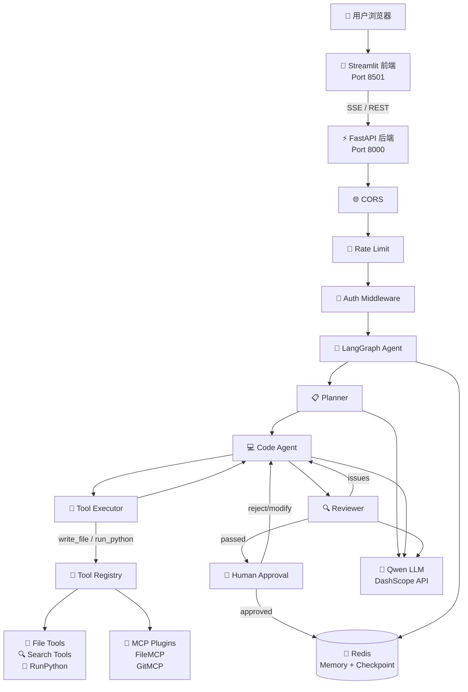
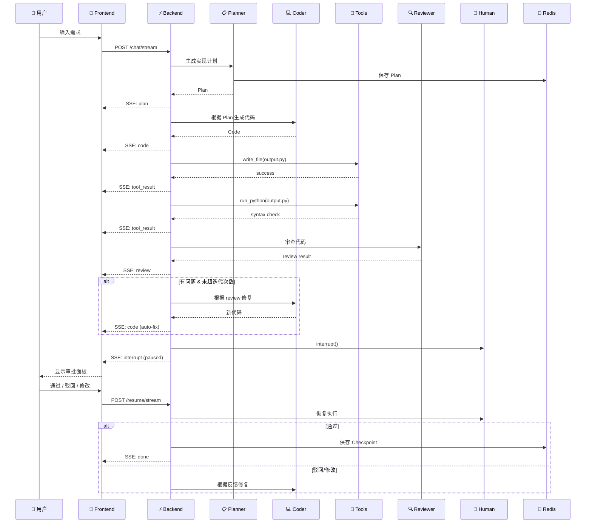

# 🧠 AI Code Assistant

> LangGraph + FastAPI + Redis + Streamlit — 全栈 AI 编程助手，支持 Planner → Coder → Reviewer → Human-in-the-Loop 完整 Agent 工作流。

<p align="center">
  
  
  
  
  
  
</p>

---

## 📖 项目简介

AI Code Assistant 是一个**全栈 AI 编程助手**，基于 LangGraph 构建多步骤 Agent 管道。用户输入自然语言需求，系统自动完成：

**需求分析 → 代码生成 → 工具执行 → 自动审查 → 人工决策**

适合：
- 需要 AI 辅助编程的**全栈开发者**
- 学习和研究 **LangGraph Agent 架构**的工程师
- 需要**本地部署**私有 AI 编程助手的企业或团队

---

## ✨ 功能展示

| 模块 | 功能 | 状态 |
|------|------|:--:|
| 🧠 **Agent 管道** | Planner → Code Agent → Tool → Reviewer → Human | ✅ |
| 💬 **多轮对话** | 会话持久化、历史搜索、点击恢复 | ✅ |
| 🔄 **Human-in-the-Loop** | 代码审查后面板审批（通过/驳回/修改） | ✅ |
| ⚡ **SSE 流式输出** | 实时管道状态推送、工具执行进度 | ✅ |
| 🧰 **工具系统** | 文件读写、搜索、Python 语法校验 | ✅ |
| 🔌 **MCP 插件** | 可扩展工具插件架构（File、Git 接口） | ✅ |
| 📁 **项目浏览器** | 侧边栏目录树、文件打开/创建/删除 | ✅ |
| 📝 **编辑器标签** | 多文件标签、Diff 对比、保存到磁盘 | ✅ |
| 📋 **Apply + Diff** | AI 生成代码的差异预览 + 一键应用 | ✅ |
| 💾 **Redis 持久化** | Session 记忆、Checkpoint 保存、TTL 管理 | ✅ |
| 🔐 **Token 认证** | Bearer Token + Session 所有权模型 | ✅ |
| 🚦 **速率限制** | 滑动窗口限流（Redis + 内存回退） | ✅ |
| 📊 **Mermaid 架构图** | 类图、序列图、流程图生成 | ✅ |
| 🌐 **国际化** | 中文 / English 界面切换 | ✅ |
| 🐳 **Docker 部署** | Dockerfile + docker-compose 生产环境 | ✅ |

---

## 🏗️ 技术架构



---

## 🛠️ 技术栈

| 层级 | 技术 | 说明 |
|------|------|------|
| **AI Framework** | LangGraph 0.2+ / LangChain Core 0.3+ | Agent 状态机、Checkpoint、Interrupt |
| **LLM** | Qwen (DashScope) via OpenAI SDK | 通义千问系列模型 |
| **Backend** | FastAPI 0.115+ / Uvicorn | 异步 REST API + SSE 流 |
| **Frontend** | Streamlit 1.30+ | 纯 Python Web UI |
| **Database** | Redis 7.0+ (async) | Session Memory + Checkpoint 持久化 |
| **Security** | Bearer Token / Timing-safe compare / CORS / Rate Limit | 多层安全防护 |
| **DevOps** | Docker / docker-compose / Makefile | 容器化部署 |
| **Testing** | unittest.mock / FastAPI TestClient | Mock LLM 的集成测试 |

---

## 📁 项目结构

```
mvp/
├── app/                          # 后端核心
│   ├── main.py                   # FastAPI 入口 (路由 + lifespan + SSE)
│   ├── agents.py                 # LangGraph 节点 (planner/coder/tool/reviewer/human)
│   ├── graph.py                  # Graph 构建 (条件路由 + 循环)
│   ├── llm.py                    # LLM Provider (Qwen + 重试 + Prompt 安全)
│   ├── state.py                  # AgentState TypedDict
│   ├── schemas.py                # Pydantic 请求/响应模型
│   ├── streaming.py              # SSE 流生成器
│   ├── config.py                 # 环境变量配置
│   ├── auth.py                   # Bearer Token 认证 (secrets.compare_digest)
│   ├── rate_limit.py             # 滑动窗口限流 (Redis + 内存回退)
│   ├── redis_client.py           # Async Redis 连接池
│   ├── redis_saver.py            # Redis Checkpoint 持久化 (JSON, 无 pickle)
│   ├── memory.py                 # Session Memory 管理器
│   ├── project_workspace.py      # 项目目录沙箱 (路径遍历防护)
│   ├── tools/                    # 原生工具系统
│   │   ├── base.py               # BaseTool ABC
│   │   ├── registry.py           # ToolRegistry 单例
│   │   ├── file_tools.py         # ReadFile / WriteFile
│   │   ├── search_tools.py       # Grep / ListFiles
│   │   ├── execution_tools.py    # RunPython (语法校验)
│   │   └── tool_policy.py        # 工具执行安全策略
│   └── mcp/                      # MCP 插件系统
│       ├── base.py               # BaseMCP ABC
│       ├── loader.py             # Plugin 发现/加载/卸载
│       ├── adapters.py           # MCP → BaseTool 适配器
│       ├── file_mcp.py           # File 操作插件
│       └── git_mcp.py            # Git 操作插件 (接口)
│
├── frontend/                     # Streamlit 前端
│   ├── app.py                    # 单入口 (页面路由 + 侧边栏)
│   ├── config.py                 # 前端配置
│   ├── i18n.py                   # 中英文国际化
│   ├── utils/session.py          # Session State 管理
│   ├── services/
│   │   ├── api_client.py         # HTTPX 后端 API 客户端
│   │   ├── history_store.py      # JSON 对话历史存储
│   │   └── file_manager.py       # 本地项目文件管理
│   ├── pages/
│   │   ├── home.py               # 首页 (快捷入口/示例 Prompt)
│   │   ├── chat.py               # 聊天页 (管道/审批/编辑器)
│   │   └── settings.py           # 设置页 (模型/Key/语言)
│   └── components/
│       ├── agent_status.py       # 5 步管道可视化
│       ├── chat_window.py        # 聊天输入 + 消息气泡
│       ├── chat_history.py       # 历史记录侧边栏
│       ├── code_viewer.py        # 代码高亮 + 复制
│       ├── editor_tabs.py        # 多文件标签编辑器
│       ├── file_operations.py    # Apply + Diff 面板
│       ├── review_panel.py       # 人工审批面板
│       └── project_explorer.py   # 目录树文件浏览器
│
├── data/                         # 本地持久化 (JSON)
├── docker/                       # Docker 配置
│   ├── Dockerfile
│   ├── docker-compose.yml
│   ├── docker-entrypoint.sh
│   └── redis.conf
│
├── test_graph.py                 # LangGraph 集成测试
├── test_stream.py                # SSE 流测试
├── test_mcp.py                   # MCP 插件测试
├── test_frontend.py              # 前端模块测试
├── test_prompt_injection.py      # Prompt 注入防护测试
│
├── run.py                        # 后端启动器
├── run_streamlit.py              # 前端启动器
├── requirements.txt              # 后端依赖
├── requirements-frontend.txt     # 前端依赖
├── .env.example                  # 环境变量模板
├── Makefile                      # 便捷命令
└── README.md
```

---

## 🚀 快速启动

### 前置条件

- Python 3.12+
- Redis 7.0+（可选，开发环境可关闭）
- Qwen DashScope API Key（[免费申请](https://dashscope.console.aliyun.com/apiKey)）

### 1. 克隆项目

```bash
git clone https://github.com/your-username/ai-code-assistant.git
cd ai-code-assistant/mvp
```

### 2. 安装依赖

```bash
# 后端
pip install -r requirements.txt

# 前端
pip install -r requirements-frontend.txt
```

### 3. 配置环境变量

```bash
cp .env.example .env
# 编辑 .env，填入你的 QWEN_API_KEY
```

### 4. 启动 Redis（可选）

```bash
# Docker
docker run -d -p 6379:6379 redis:7-alpine

# 或使用项目 docker-compose
docker compose up -d redis
```

关闭 Redis 不影响开发：设置 `REDIS_ENABLED=false` 使用内存回退。

### 5. 启动后端

```bash
python run.py
# → http://localhost:8000
# → Swagger UI: http://localhost:8000/docs
```

### 6. 启动前端

```bash
python run_streamlit.py
# → http://localhost:8501
```

### 7. Docker 生产部署

```bash
cp .env.example .env.production
# 编辑 .env.production 填入生产配置
docker compose up -d
```

---

## ⚙️ 配置说明

| 环境变量 | 默认值 | 说明 |
|----------|--------|------|
| `QWEN_API_KEY` | — | **必填** 通义千问 API Key |
| `QWEN_MODEL` | `qwen-plus` | 模型选择 (qwen-plus/max/turbo) |
| `QWEN_BASE_URL` | `https://dashscope.aliyuncs.com/compatible-mode/v1` | API 地址 |
| `REDIS_ENABLED` | `true` | Redis 开关 (false=内存回退) |
| `REDIS_URL` | `redis://localhost:6379/0` | Redis 连接地址 |
| `APP_HOST` | `0.0.0.0` | 后端监听地址 |
| `APP_PORT` | `8000` | 后端端口 |
| `LOG_LEVEL` | `info` | 日志级别 |
| `WORKERS` | `1` | Uvicorn Worker 数 |
| `SESSION_TTL_SECONDS` | `86400` | Session 过期时间 (24h) |
| `API_AUTH_TOKEN` | — | Bearer Token (留空=不启用) |
| `CORS_ORIGINS` | `*` | 允许的跨域来源 |
| `RATE_LIMIT_REQUESTS` | `100` | 每窗口最大请求数 |
| `RATE_LIMIT_WINDOW_SECONDS` | `60` | 限流窗口大小 (秒) |
| `LANGSMITH_API_KEY` | — | LangSmith 可观测性 (可选) |
| `SENTRY_DSN` | — | Sentry 错误追踪 (可选) |

---

## 🔄 工作流程



---

## 🌟 项目亮点

1. **完整 Agent 管道** — Planner → Coder → Tools → Reviewer → Human-in-the-Loop，LangGraph 原生实现
2. **Human-in-the-Loop** — LangGraph `interrupt()` 机制，代码审查后人工决策（通过/驳回/修改）
3. **SSE 实时流** — Server-Sent Events 推送管道进度，前端实时渲染每一步
4. **Redis 持久化** — Session Memory + Checkpoint 双存储，支持 Worker 重启恢复
5. **无 Pickle 安全** — Checkpoint 序列化使用 JSON+类型标签，消除 RCE 风险
6. **多层安全防护** — Timing-safe Token 比较、Prompt 注入防护、路径遍历沙箱、工具策略卫士
7. **MCP 插件架构** — 可扩展的工具插件系统，支持动态加载/卸载/重载
8. **中文优先** — 完整的国际化支持，适合国内开发者和团队
9. **Docker 生产就绪** — 多阶段构建、非 root 用户、健康检查、Redis AOF 持久化
10. **Mock 测试体系** — LLM 调用全 Mock，集成测试覆盖 SSE/Graph/MCP/前端模块

---

## 🔒 安全设计

| 防护层 | 实现 | 说明 |
|--------|------|------|
| **认证** | Bearer Token (`secrets.compare_digest`) | 时序攻击防护 |
| **权限** | Session 所有权模型 | Token → SHA-256 → 绑定 Session |
| **CORS** | CORSMiddleware | 白名单 + `credentials` 安全检查 |
| **限流** | 滑动窗口 (Redis ZSET) | 100 req/60s 默认，429 返回 |
| **Prompt Injection** | `<PRIORITY>` + `<UserRequest>` 标签 | 三层纵深防御 |
| **路径遍历** | `resolve()` + `is_relative_to()` + 绝对路径拒绝 | Windows/Unix 全覆盖 |
| **Tool Policy** | 敏感文件保护 + 危险代码扫描 | write/read/run 预检 |
| **序列化** | JSON (非 pickle) | Checkpoint 无 RCE 风险 |
| **异常安全** | API Key 日志脱敏 | `_sanitize_error()` 替换密钥 |

---

## 🗺️ Roadmap

- [x] LangGraph Agent 管道 (Planner → Coder → Reviewer → Human)
- [x] SSE 实时流式输出
- [x] Redis Session Memory + Checkpoint 持久化
- [x] MCP 插件系统 (FileMCP, GitMCP 接口)
- [x] 项目浏览器 + 编辑器标签 + Diff 对比
- [x] Human-in-the-Loop 审批面板
- [x] 多 Worker 安全 (per-thread Hash 存储)
- [x] Prompt Injection 三层防御
- [x] API 速率限制 (滑动窗口)
- [x] Session 所有权模型
- [x] Docker 生产部署
- [ ] Git 操作 (GitPython 实现)
- [ ] Python 代码沙箱执行
- [ ] OAuth2 / OIDC 认证
- [ ] PostgreSQL Checkpoint 后端
- [ ] LangSmith / LangFuse 可观测性集成
- [ ] 单元测试覆盖率 > 80%
- [ ] VS Code Extension

---

## 📄 License

MIT License — 详见 [LICENSE](./LICENSE) 文件。

选择 MIT 的原因：
- **最大自由度**：允许商业使用、修改、分发、私有使用
- **社区友好**：GitHub 上最流行的开源许可证之一
- **责任明确**：软件按"原样"提供，作者不承担担保责任

---

## 🙏 致谢

本项目基于以下优秀的开源框架构建：

- [LangGraph](https://github.com/langchain-ai/langgraph) — Agent 状态机框架
- [LangChain](https://github.com/langchain-ai/langchain) — LLM 应用框架
- [FastAPI](https://github.com/tiangolo/fastapi) — 高性能 Python Web 框架
- [Streamlit](https://github.com/streamlit/streamlit) — 数据应用 UI 框架
- [Redis](https://redis.io/) — 内存数据库
- [Qwen](https://tongyi.aliyun.com/) — 通义千问大语言模型


  🚀 前后端启动方式

  # 终端 1：启动后端
  cd mvp
  python run.py
  # → http://localhost:8000
  # → Swagger UI: http://localhost:8000/docs

  # 终端 2：启动前端
  python run_streamlit.py
  # → http://localhost:8501

  ▎ 注意：必须用 python run_streamlit.py，不能用
  ▎ streamlit run
  ▎ run_streamlit.py。后者会触发嵌套启动循环。